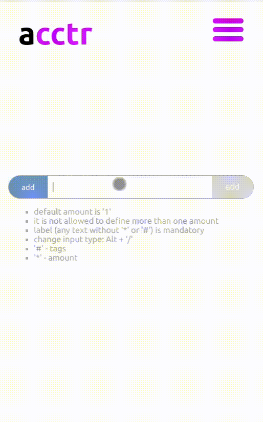
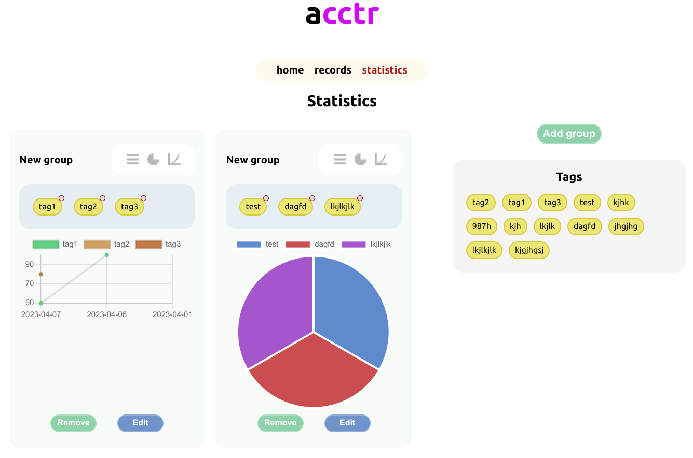

# Entities accumulator
## [Deploy on gh-pages](https://emp74ark.github.io/acctr/)
## Description
Application save, count and visualize entities by tags, that can be added using simple syntax to input field ('#' means tag, '*' means amount)

**Mobile**:

**Descktop**:

